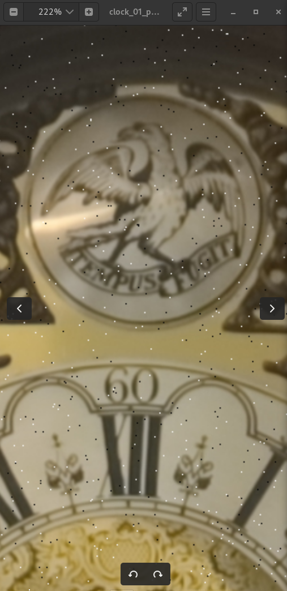

# Hot and Dead Pixel Detection and Correction in Odin

A simple yet interesting program that shows the performance of the Odin language on large images.

## Description
This program is to be used as part of a final program, and it's a prototype program to play with the ideas and algorithms. It loads a image jpeg, png, spreads N hot and dead pixels in the image, then it detects the positions of the hot pixels and the dead pixels (the heaviest part of the algorithm) and then it corrects the hot and dead pixels and saves the final image. If you read and write jpg's file format for a 10 mega pixel image of 3600 x 2700 image, and only save once the final image, this algorithm only takes 0.4 seconds to run. In the future, it can be greatly optimized with SIMD instructions and other optimizations. The algorithm is based on the idea of kernels for the detection of hot and dead pixels. In the practical case, one would use the hot and dead pixel detection to create a map of the hot and dead pixels on several images and then use the map that is common to more of the images for that camera, to correct the hot and dead pixels. Used in that way the algorithm is very fast and low overhead. In principle this algorithm could be used for image processing and for the processing of each frame before compression into a video.

## Image with Hot pixels and Dead pixels added



## Image with Hot pixels and Dead pixels corrected


## Libs used
This program uses the stb_image library to load and save images, that comes with the Odin vendors API. Don't forget that to compile this program, you need to have previously compiled the stb lib.

``` bash
# In Linux do:

$ cd Odin/vendors/stb/src
$ make

# Then go to where you have this project and do

$ make

# or 

$ make opti

$ make run
```

## License

MIT Open Source License

## Have fun!
Best regards, <br>
João Carvalho <br>

